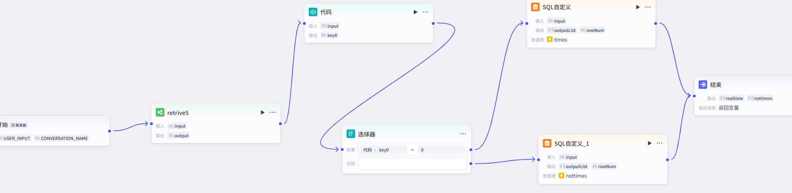

# 智能问答系统 (RAG-based Q&A)

基于 **检索增强生成 (RAG)** 的智能问答系统，利用 WiFi 信道状态信息（CSI）数据进行人员定位与查询。系统通过 Coze 工作流解析自然语言查询，结合 Milvus 向量数据库进行语义检索，最终由大语言模型生成回答。

## 系统架构

```
用户查询 → Coze API (查询分解) → Milvus (向量检索) → LLM (答案生成) → 返回结果
```



## 功能特点

- **智能查询分解** — 集成 Coze API 工作流，将自然语言拆解为结构化查询
- **向量语义检索** — 使用 Milvus + BGE Embedding 进行高效的 CSI 特征向量相似度搜索
- **多模型 LLM 支持** — 同时支持 OpenAI 兼容接口与 DeepSeek API
- **流式 Coze 响应** — 支持 Coze 工作流的流式输出解析
- **Web 交互界面** — 内置 Flask Web 服务，提供简洁的聊天 UI
- **调试信息面板** — 可视化展示 Coze 查询分解结果与 Milvus 检索上下文

## 环境要求

- Python 3.8+
- [Milvus 向量数据库](https://milvus.io/)（推荐 Docker 部署）
- NVIDIA CUDA（可选，用于加速向量编码）

## 快速开始

### 1. 安装依赖

```bash
pip install -r requirements.txt
```

### 2. 配置环境变量

```bash
cp .env.example .env
```

编辑 `.env` 文件，填入你的 API 密钥和服务配置：

| 变量 | 说明 | 示例 |
|---|---|---|
| `OPENAI_API_KEY` | OpenAI 兼容 API 密钥 | `sk-xxx` |
| `OPENAI_BASE_URL` | OpenAI 兼容 API 地址 | `https://xiaoai.plus/v1` |
| `DEEPSEEK_API_KEY` | DeepSeek API 密钥 | `sk-xxx` |
| `DEEPSEEK_BASE_URL` | DeepSeek API 地址 | `https://api.deepseek.com/v1` |
| `COZE_ACCESS_TOKEN` | Coze API 访问令牌 | `Bearer pat_xxx` |
| `COZE_WORKFLOW_ID` | Coze 工作流 ID | — |
| `COZE_APP_ID` | Coze 应用 ID | — |
| `MILVUS_HOST` | Milvus 数据库主机 | `localhost` |
| `MILVUS_PORT` | Milvus 数据库端口 | `19530` |
| `EMBEDDINGS_MODEL_PATH` | BGE 嵌入模型路径 | `/path/to/bge-large-zh-v1.5` |

### 3. 启动 Milvus（Docker）

```bash
docker run -d --name milvus-standalone \
  -p 19530:19530 \
  -p 9091:9091 \
  milvusdb/milvus:latest
```

可选：使用 [ATTU](https://github.com/zilliztech/attu) 可视化 Milvus 数据库。

### 4. 写入向量数据

将 CSI 特征数据导入 Milvus 数据库：

```bash
python test/insert_data_to_milvus.py
```

**前置准备：**
1. 下载 BGE 嵌入模型（推荐 [BAAI/bge-large-zh-v1.5](https://huggingface.co/BAAI/bge-large-zh-v1.5)），768 维
2. 将 `data/` 目录下的 JSON 数据文件导入
3. 运行 `test/query_milvus_test.py` 验证向量检索是否正常
4. 注意在代码中配置正确的 collection 名称

### 5. 配置 Coze 工作流

1. 在 Coze 平台创建工作流，参考工作流架构图：
   
2. 主要功能：解析自然语言查询，生成结构化查询并返回结果
3. 配置 SQL 数据库（参考 `data/` 目录中的 xlsx 格式）
4. 发布 API，运行 `test/coze_api_test.py` 验证

### 6. 运行系统

```bash
# Web 服务模式（默认端口 5000）
python app.py --mode server --port 5000

# 命令行交互模式
python app.py --mode cli
```

打开浏览器访问 `http://localhost:5000` 进入 Web 交互界面。

## 项目结构

```
├── app.py                        # 主应用入口
├── app-v1.py                     # 旧版实现（OpenAI SDK 版本）
├── requirements.txt              # Python 依赖
├── .env.example                  # 环境变量模板
├── .gitignore
├── LICENSE
├── readme.md
│
├── data/                         # CSI 特征数据集（JSON + XLSX）
├── pic/                          # 架构图与工作流截图
├── static/                       # Web 静态文件
├── templates/                    # HTML 模板
│
└── test/                         # 测试与工具脚本
    ├── ai_chat_test.py           # LLM 问答测试
    ├── api_test.py               # API 连通性测试
    ├── coze_api_test.py          # Coze 工作流测试
    ├── full_workflow_test.py     # 完整流程测试
    ├── insert_data_to_milvus.py  # 向量数据导入工具
    ├── query_milvus_chat.py      # 批量效果评估
    ├── query_milvus_test.py      # 向量检索测试
    └── rag_test.py               # RAG 流水线测试
```

## 数据说明

`data/` 目录包含 WiFi CSI（信道状态信息）特征数据：
- `people*.json` — 采集的 CSI 幅值特征向量，每条记录包含 `input`（特征向量）和 `output`（人员标签）
- `nottimes.xlsx` / `times.xlsx` — 排班与考勤参考数据

## 许可证

本项目采用 [MIT License](LICENSE)。
